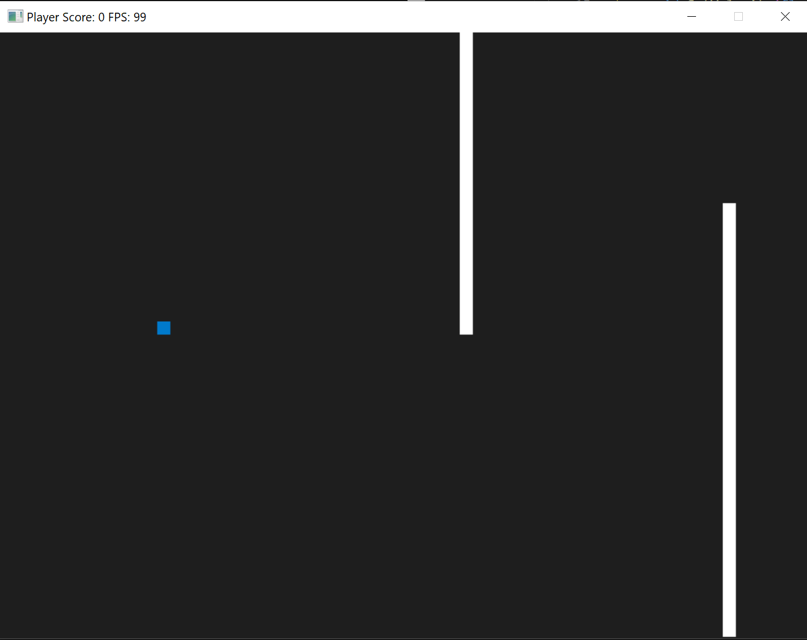

# SpaceEvader

## Project
SpaceEvader is a small arcade game created with C++ using the SDL2 Library. The goal of the game is to evade the obstacles using ArrowUp and ArrowDown on the keyboard.
The game was created as a project work to learn C++ and used [this](https://github.com/udacity/CppND-Capstone-Snake-Game) code as a starting point. There are many more features which can be added in time.

## Dependencies for Running Locally
* cmake >= 3.7
  * All OSes: [click here for installation instructions](https://cmake.org/install/)
* make >= 4.1 (Linux, Mac), 3.81 (Windows)
  * Linux: make is installed by default on most Linux distros
  * Mac: [install Xcode command line tools to get make](https://developer.apple.com/xcode/features/)
  * Windows: [Click here for installation instructions](http://gnuwin32.sourceforge.net/packages/make.htm)
* SDL2 >= 2.0
  * All installation instructions can be found [here](https://wiki.libsdl.org/Installation)
  * Note that for Linux, an `apt` or `apt-get` installation is preferred to building from source.
* gcc/g++ >= 5.4
  * Linux: gcc / g++ is installed by default on most Linux distros
  * Mac: same deal as make - [install Xcode command line tools](https://developer.apple.com/xcode/features/)
  * Windows: recommend using [MinGW](http://www.mingw.org/)
  
## Basic Build Instructions
### Linux
1. Clone this repo.
2. Make a build directory in the top level directory: `mkdir build && cd build`
3. Compile: `cmake .. && make`
4. Run it: `./SpaceEvader`.

### Windows
The project can also be built using Windows. The `build_win.bat` file can be used. Instead of MinGW I have used MSVC. Visual Studio  and the corresponding c++ build tools needs to be installed and the path to the devenv.exe file needs to be adjusted in the `build_win.bat` file.

## Project Structure
All the necessary source files are in the folder `src`. 
* main.cpp runs an instance of the class **Game**
* game.cpp controls the game loop, and creates **Renderer**, **Obstacles**, **Controller** and **Player**
* controller.cpp manages user input
* renderer.cpp creates the graphics
* gameobject.cpp is an abstract class defining objects used in the game, mainly responsible for shape/position and movement
* player.cpp inherits from gameobject and is the object which is controlled by the player
* obstacles.cpp describes the objects which move over the screen and need to be evaded by the player

## Rubric Points adressed
#### Loops, Functions, I/O
* Point 1: everywhere, different loops used in game.cpp
* Point 3: controller.cpp, player.cpp

#### Object Oriented Programming
* Point 1: obstacles.cpp, gameobject.cpp, player.cpp
* Point 2: see Point 1
* Point 3: game.cpp line 7
* Point 4: class methods comments in .cpp files, verbose method and member names
* Point 5: see Point 1
* Point 6: Abstract classes -> GameObject
* Point 7: obstacle.h line 15+16
* Point 8: player.h line 26

#### Memory Management
I have not used any memory allocation on the heap. However, care has benn given for correct scope allocations and management of resources
* Point 1: obstacle.h line 11, game.h line 18
* Point 3: throughout the project
* Point 5: game.cpp line 51

#### Concurrency
I programmed an option to use tasks. Since the work done by those tasks are very small however, the performance decreases using tasks. That is why I commented this option out.
* Point 1: game.cpp lines 85-94
